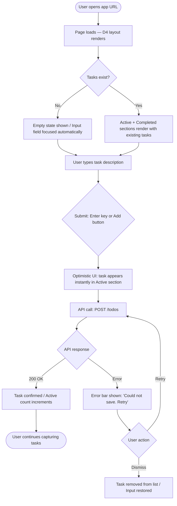
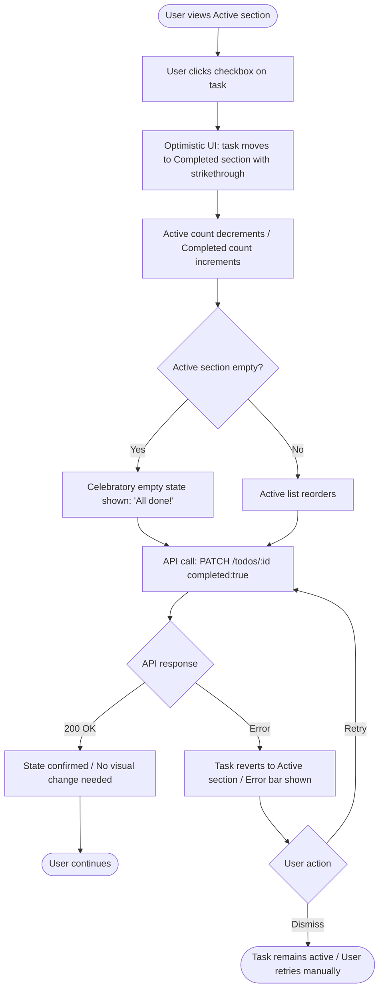
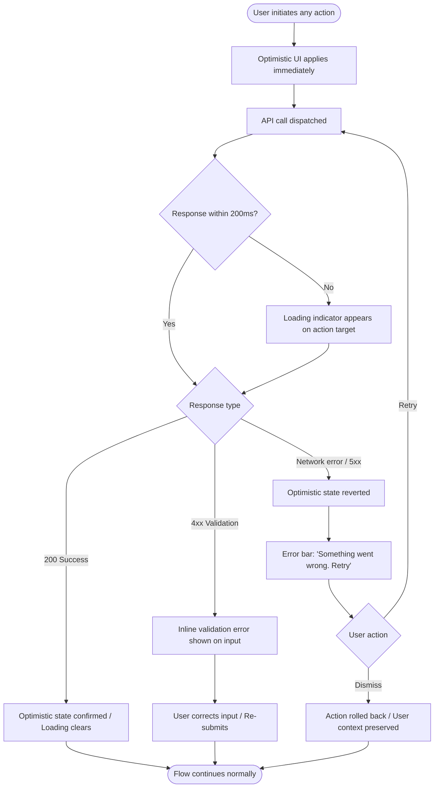
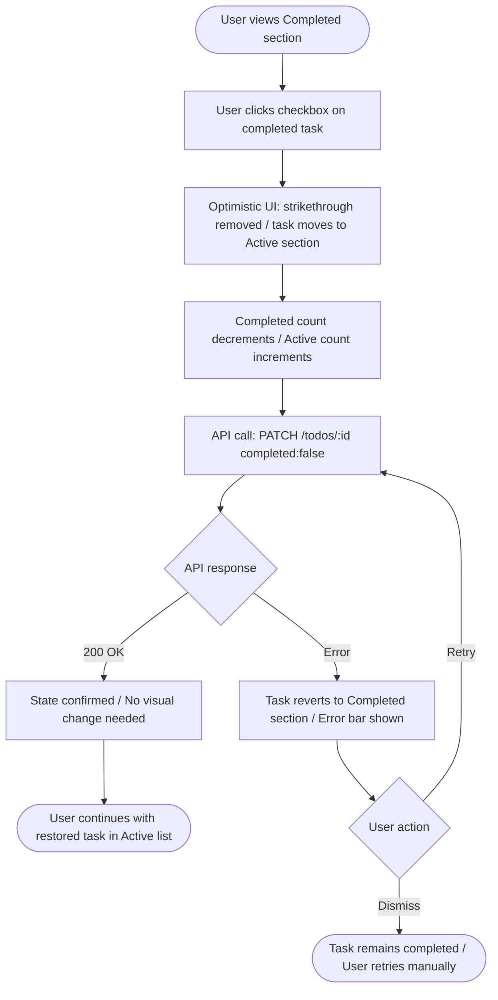

# UX Design Specification bmad-experiment

**Author:** Danijel
**Date:** 2026-03-08

---

<!-- UX design content will be appended sequentially through collaborative workflow steps -->

## Executive Summary

### Project Vision

bmad-experiment is a full-stack personal task management application built on the philosophy of "radical simplicity." In a market where todo tools compete by adding features, this product competes by removing friction. The core strategy: enable users to go from "I need to remember something" to "it's captured" in under 2 seconds with zero cognitive overhead. The application delivers four essential operations—create, view, complete, delete—with no signup, no onboarding, and no configuration. Users open the app and immediately start working.

### Target Users

Individual users who need fast, frictionless daily task tracking without project management complexity. These users don't need hierarchies, collaboration features, or integrations—they need a reliable, instant place to capture what needs to get done today. Technical skill levels vary, but all share a common frustration: current solutions bury the simple act of tracking a task under layers of unnecessary features. Primary usage patterns include cross-device access (mobile for quick capture, desktop for review) and "in the moment" task entry throughout the day.

### Key Design Challenges

1. **Instant Usability vs. Feature Discoverability** - With zero onboarding, every interaction must be self-evident. Users need to understand how to create, complete, and delete tasks without guidance, while still discovering features like toggling completed tasks back to active.

2. **Speed Perception at Scale** - As the todo list grows, maintaining the feeling of instant response becomes harder. The UI must handle both empty states and lists with dozens of items while keeping interactions feeling immediate (< 100ms perceived response time).

3. **Mobile-First Friction Reduction** - On mobile devices, every tap and scroll adds friction. The 44×44px touch target requirement must balance with screen real estate, especially at 320px width where space is extremely limited.

### Design Opportunities

1. **Zero-State Excellence** - The empty state is the first impression for every new user. This is the moment to communicate the entire value proposition and invite the first action without feeling like onboarding.

2. **Visual Hierarchy as the Only Guide** - With no tutorials or tooltips, typography, spacing, and visual weight become the primary teaching tools. Great visual design can make the interface completely self-documenting.

3. **Micro-Interactions for Feedback** - Since every action must feel instant, micro-interactions (animations, transitions, state changes) become critical for communicating success and building trust in the system's reliability.

## Core User Experience

### Defining Experience

The core user experience centers on instant task capture—the ability to go from thought to saved task in under 2 seconds with zero cognitive overhead. This is the ONE interaction that defines the product's value. Users open the app and immediately see a task input field, ready to receive their first thought. Type, press Enter, done. The task appears in the list instantly with no intermediate steps, no confirmation dialogs, no "save" buttons. This capture-first experience is what users will do most frequently, and nailing this interaction makes everything else follow naturally. If users trust that capturing a task is always immediate and effortless, they adopt the app as their external brain.

### Platform Strategy

bmad-experiment is a responsive web application accessed through browsers across all devices—not a native mobile or desktop app. The interface spans viewport sizes from 320px (mobile) to 1920px (desktop), seamlessly adapting to both touch-based interactions on mobile devices and mouse/keyboard input on desktop systems. Touch targets meet the 44×44px minimum on mobile to ensure tap accuracy. The platform prioritizes universal web fundamentals over device-specific features, with no offline functionality in the MVP—all data persists through the backend API. Page loads complete in under 1 second on standard broadband connections, establishing instant availability as a platform expectation.

### Effortless Interactions

Creating a task requires only typing and pressing Enter—no buttons to hunt for, no forms to fill. Completing a task is a single tap or click with immediate visual feedback as the task transitions to completed state. Viewing all tasks happens automatically on page load with no navigation or menus. Data persists automatically with no explicit "save" actions—timestamps are captured, completed states are saved, and everything survives page refreshes without user intervention. The app eliminates steps competitors require: no account creation, no setup wizards, no task organization into projects or categories, no configuration screens. Loading states appear within 200ms so users never wonder if something's happening. The interface responds so fast that users never question whether their action registered.

### Critical Success Moments

The first critical moment occurs during initial task creation—when a new user types their first task, presses Enter, and sees it instantly appear. This is when "radical simplicity" becomes tangible rather than abstract. The second moment happens when users mark a task complete and see the visual change (strikethrough, dimmed styling)—that moment of closure is intrinsically satisfying. The third moment is returning to the app hours or days later and seeing tasks exactly as they were left—this builds trust that the app reliably holds their data. If task creation feels slow or uncertain ("did it save?"), the entire value proposition collapses. If data is ever lost—even once—users lose trust permanently. First-time user success happens within 3 interactions: open app, type task, press Enter, task saved.

### Experience Principles

1. **Speed is a Feature** - Every interaction must feel instant. Task capture completes in under 2 seconds, UI updates respond within 100ms, and page loads finish within 1 second. Speed isn't a technical metric—it's the core product differentiator that makes the experience frictionless.

2. **Zero Cognitive Load** - Users should never need to think about how to use the interface. The task input is immediately visible on page load, actions are single-step (type→Enter, click checkbox, click delete), and there are no decisions to make about organization, settings, or configuration.

3. **Trust Through Reliability** - Users must trust that their data is safe and their actions succeed. Automatic persistence, clear visual feedback for every action, robust error handling with retry options, and zero data loss build the confidence needed for users to rely on this as their external brain.

4. **Universal Accessibility** - The interface works seamlessly across all contexts—320px mobile screens with touch input or 1920px desktop displays with mouse/keyboard. Touch targets meet minimum sizes, visual hierarchy guides interaction without tutorials, and responsive design adapts without compromising functionality.

## Desired Emotional Response

### Primary Emotional Goals

Calm confidence is the cornerstone emotional experience for bmad-experiment. Users should feel in control and certain that the tool works reliably without demanding mental overhead. The tool becomes invisible infrastructure for their thoughts, creating a sense of relief that they finally have a frictionless way to capture tasks. This emotional state differentiates the product from competitors that create overwhelm and anxiety through complexity. Users transition from cautious skepticism (based on past tool frustrations) to confident reliance through repeated successful interactions that validate the "radical simplicity" promise.

### Emotional Journey Mapping

**Discovery**: Curious but cautiously optimistic. Users arrive with skepticism from past experiences with bloated tools, but the promise of radical simplicity creates intrigue—"could this actually be different?"

**First Use**: The initial task capture should create a spark of recognition—"this really is different." Focused efficiency replaces anxiety. The tool feels invisible, just an extension of their thought process with zero friction.

**Task Completion**: Accomplished and validated. Marking a task complete triggers satisfying closure. The visual change (strikethrough, dimmed styling) provides immediate gratification that reinforces the completion action.

**Error Recovery**: Informed and reassured, not frustrated. Clear error messages with retry options make users feel "okay, that happened, but I know what to do about it." The system feels forgiving and recoverable, maintaining trust even during failures.

**Return Visits**: Confident and welcomed. Their data is exactly where they left it, the input is ready for their next task, and everything feels familiar and reliable. Repeated success builds trust that becomes habit.

### Micro-Emotions

**Confidence vs. Confusion**: Critical emotional axis. Users must feel confident with every interaction—no moments of "did that work?" or "what do I click?" The zero-onboarding approach means confidence must be instant and sustained through self-documenting design.

**Trust vs. Skepticism**: Essential for adoption. Given users' past frustrations, building trust is paramount. Every successful interaction, especially data persistence across sessions, converts initial skepticism into earned trust.

**Accomplishment vs. Frustration**: Core to retention. Completing a task should always feel like an achievement. Frustration must be eliminated through speed, clarity, and forgiving interactions that allow state changes without penalty.

**Delight vs. Satisfaction**: Dual value. Satisfaction comes from reliable functionality—it works every time as expected. Delight comes from exceeding expectations—it's faster than imagined, it remembered everything perfectly, it's unexpectedly beautiful in its minimalism.

### Design Implications

**Building Confidence Through Design:**

- Task input field is the dominant element on page load—users instantly know where to start
- Single-path interactions with no decision trees or modal choices—every action has one obvious execution path
- Instant visual feedback within 100ms for every action (button states, task appearance, completion styling)
- Unmistakable visual distinction between active and completed tasks—no state ambiguity
- Typography hierarchy and visual weight guide users without text labels or instructions

**Avoiding Negative Emotions:**

- Loading indicators appear within 200ms to prevent "is something happening?" anxiety
- Automatic persistence with clear visual confirmation eliminates "did it save?" uncertainty
- All controls remain visible in expected locations—no hunting for hidden actions
- Actionable error messages with retry options instead of user-blaming text
- Consistent responsive patterns prevent unexpected behavior across devices

**Creating Moments of Delight:**

- First task capture exceeds speed expectations
- Smooth micro-animations on task completion feel satisfying without slowing interaction
- Returning after days and finding data perfectly preserved builds lasting trust
- Page loads feel instant, defying typical web app expectations

**Emotion-Design Connections:**

- **Confidence** → Immediate visual clarity, instant feedback, self-documenting interface, single-path actions
- **Trust** → Automatic persistence, zero data loss, consistent performance, clear error recovery
- **Accomplishment** → Visual task completion feedback, satisfying micro-animations, clear state changes
- **Delight** → Exceeding speed expectations, smooth transitions, beautiful minimalist design

### Emotional Design Principles

1. **Invisible Reliability** - The tool should fade into the background, becoming trusted infrastructure rather than demanding attention. Users think about their tasks, not the tool holding them.

2. **Immediate Validation** - Every user action receives instant visual confirmation. Uncertainty creates anxiety; immediate feedback builds confidence.

3. **Forgiving Interactions** - Users can toggle states, recover from errors, and change their minds without penalty. Forgiveness builds trust that users won't "break" the system.

4. **Earned Trust Through Consistency** - Reliability isn't promised, it's demonstrated through repeated flawless performance. Every successful session reinforces that data will be there next time.

5. **Delight Through Restraint** - Moments of delight emerge from doing the simple things exceptionally well, not from adding surprising features. Speed, clarity, and beauty create lasting emotional impact.

## UX Pattern Analysis & Inspiration

### Inspiring Products Analysis

**Todoist**

- Solves quick task capture and personal organization with low setup overhead.
- Effective onboarding through immediate input visibility and clear empty-state guidance.
- Uses a list-first hierarchy that minimizes cognitive load and keeps users focused on action.
- Delivers compelling speed in task entry and completion feedback.
- Supports trust with predictable persistence and clear task state representation.

**Linear**

- Solves workflow execution with exceptional responsiveness and precision.
- Uses opinionated defaults and progressive discovery rather than heavy upfront setup.
- Maintains clear hierarchy while preserving speed for frequent interactions.
- Creates delight via smooth transitions, immediate feedback, and keyboard-efficient patterns.
- Reinforces confidence through consistent system behavior and reliable interaction loops.

### Transferable UX Patterns

**Navigation Patterns**

- Single-screen primary workspace combining task input and task list.
- Minimal global navigation to keep users in the core capture-complete loop.

**Interaction Patterns**

- Input-first instant capture flow (focus on input by default).
- Immediate task state updates with lightweight feedback animations.
- Keyboard-first efficiency with equivalent touch interactions for mobile.

**Visual Patterns**

- Clear active vs completed task distinction to reduce ambiguity.
- Strong typographic and spacing hierarchy for fast scanning.
- Minimal interface chrome to reduce distraction and confusion.

### Anti-Patterns to Avoid

- Introducing advanced structures too early (projects/tags/filters) that increase confusion in MVP.
- Hiding core actions behind menus, modals, or secondary interaction paths.
- Using slow decorative animations that delay feedback and reduce perceived speed.
- Creating ambiguous save or completion states that erode confidence.
- Overloading first-time experience with setup choices that conflict with zero cognitive load.

### Design Inspiration Strategy

**What to Adopt**

- Todoist-style frictionless capture and list clarity.
- Linear-style responsiveness, precision feedback, and interaction speed.

**What to Adapt**

- Adapt Linear-inspired efficiency patterns to a simpler information density suitable for general users.
- Adapt Todoist-inspired clarity while removing non-essential organizational complexity in MVP.

**What to Avoid**

- Workflow complexity and configurability in early versions.
- Discoverability models that rely on tutorials rather than self-evident interaction design.

This inspiration strategy supports the core emotional goal of confidence over confusion while preserving the product's radical simplicity positioning.

## Design System Foundation

### 1.1 Design System Choice

Themeable design system approach using a proven component foundation with strong customization capabilities (e.g., MUI or Chakra UI) for responsive web delivery.

### Rationale for Selection

- Balances speed and uniqueness: faster than a custom system while preserving product identity.
- Aligns with MVP priorities: simplicity, speed, and intuitivity with minimal implementation overhead.
- Supports consistency and accessibility through mature component primitives.
- Matches emotional goals: predictable component behavior reinforces confidence over confusion.
- Reduces long-term maintenance risk compared with fully custom component architecture.

### Implementation Approach

- Start with core primitives required for the task loop: input, button, list item, checkbox, badges, and feedback states.
- Define design tokens early (spacing, typography, color, radius, motion) and apply them through the theme layer.
- Build thin product-specific wrapper components only where interaction semantics require it.
- Preserve high performance and perceived speed by favoring lightweight transitions and minimal rendering complexity.
- Ensure keyboard and touch parity across all primary interactions.

### Customization Strategy

- Apply a minimalist visual language with high contrast and clear state communication.
- Prioritize active/completed/loading/error state legibility over decorative styling.
- Standardize interaction feedback timing to keep responses immediate and predictable.
- Constrain component variants to reduce UI drift and preserve intuitivity.
- Evolve theming incrementally after MVP validation rather than introducing broad visual complexity upfront.

## 2. Core User Experience

### 2.1 Defining Experience

The defining experience for bmad-experiment is: capture a task instantly and trust it is saved. This is the core interaction users will describe to others and the primary moment where product value is delivered. The experience succeeds when users can move from intent to persistence with minimal effort, no ambiguity, and immediate confirmation.

### 2.2 User Mental Model

Users approach the product with an urgent capture mindset: "I need to store this now before I forget." They expect a direct flow with no setup overhead: open app, type task, submit, and see confirmation immediately. Their baseline comparison includes tools that introduce friction through extra structure, hidden actions, or uncertain save states. The design must map directly to this mental model by keeping task capture visible, obvious, and interruption-free.

### 2.3 Success Criteria

- Users can add a task in one uninterrupted flow (type + submit).
- System feedback is immediate and unambiguous (new task appears instantly).
- Users trust persistence through repeat validation (task remains after refresh and return).
- Core interaction remains consistent across touch and keyboard contexts.
- Errors are recoverable without breaking confidence in the capture flow.

### 2.4 Novel UX Patterns

The core experience should use established patterns rather than novel interactions. Familiar controls (input, list, checkbox/toggle, delete action) reduce learning cost and reinforce intuitivity. Innovation comes from execution quality—speed, clarity, and confidence—rather than inventing new interaction paradigms. This aligns with the product goal of zero cognitive load and confidence over confusion.

### 2.5 Experience Mechanics

**1. Initiation**

- Primary task input is immediately visible on load and ready for interaction.
- Empty state invites first action with a clear, minimal prompt.

**2. Interaction**

- User enters task text and submits via Enter key or primary add action.
- Input behavior remains consistent on desktop and mobile.

**3. Feedback**

- New task appears in the list immediately after submission.
- Visual feedback confirms state changes for create/complete/delete actions.
- Loading/error feedback is explicit and non-disruptive.

**4. Completion**

- User sees the saved task in the correct state and can continue immediately.
- Flow supports rapid repetition (capture multiple tasks without friction).
- Persistence is reinforced on refresh/return, establishing long-term trust.

## Visual Design Foundation

### Color System

**Theme: Charcoal Focus**

| Token                    | Value     | Usage                                     |
| ------------------------ | --------- | ----------------------------------------- |
| `--color-bg`             | `#18181b` | App background                            |
| `--color-surface`        | `#27272a` | Card / list surface                       |
| `--color-border`         | `#3f3f46` | Dividers, input borders                   |
| `--color-border-subtle`  | `#27272a` | Subtle separators                         |
| `--color-text-primary`   | `#fafafa` | Task text, headings                       |
| `--color-text-secondary` | `#71717a` | Timestamps, metadata                      |
| `--color-text-disabled`  | `#52525b` | Completed task text                       |
| `--color-primary`        | `#a78bfa` | Accent — checkboxes, buttons, focus rings |
| `--color-success`        | `#4ade80` | Completed state                           |
| `--color-error`          | `#f87171` | Error messages                            |
| `--color-error-surface`  | `#2d1515` | Error background                          |

Contrast ratios meet WCAG 2.1 AA: `#fafafa` on `#18181b` = 16.7:1; `#71717a` on `#18181b` = 4.6:1.

### Typography System

**Primary typeface:** Inter (Google Fonts)
**Fallback:** system-ui, -apple-system, sans-serif

| Scale         | Size | Weight  | Usage                   |
| ------------- | ---- | ------- | ----------------------- |
| `--text-xl`   | 20px | 700     | App title / page header |
| `--text-lg`   | 17px | 600     | Section headings        |
| `--text-base` | 14px | 400/500 | Task text, input        |
| `--text-sm`   | 12px | 400     | Timestamps, metadata    |
| `--text-xs`   | 11px | 700     | Labels, badges, tags    |

Line height: `1.5` for body text, `1.2` for headings. Letter spacing: default for body, `0.08em` for uppercase labels.

### Spacing & Layout Foundation

**Base unit:** 4px. All spacing is a multiple of 4.

**Comfortable density scale:**

| Token       | Value | Usage                                |
| ----------- | ----- | ------------------------------------ |
| `--space-1` | 4px   | Icon gaps, tight inline spacing      |
| `--space-2` | 8px   | Input padding, badge padding         |
| `--space-3` | 12px  | Input/button vertical padding        |
| `--space-4` | 16px  | Section padding, task row horizontal |
| `--space-5` | 18px  | Section header padding               |
| `--space-6` | 24px  | Page margin                          |

**Task row spacing:** 13px top/bottom padding (comfortable, supports ≥44px tap target on mobile).

**Layout:** Single-column, content-width capped at `640px` centered. Max content width prevents line-length fatigue on wide viewports.

**Border radius:** `8px` inputs, `7px` buttons, `10px` surface cards, `50%` checkboxes.

### Accessibility Considerations

- All text/background pairs meet WCAG 2.1 AA (4.5:1 minimum for normal text, 3:1 for large text)
- Interactive elements meet minimum 44×44px touch target on mobile viewports
- Focus rings use `--color-primary` (`#a78bfa`) with 2px offset, visible on all backgrounds
- Error states use both color and icon (⚠) to avoid color-only communication
- Completed tasks use strikethrough + opacity reduction (not color alone) for state communication

## Design Direction Decision

### Design Directions Explored

Six layout directions were explored using the Charcoal Focus theme, Inter typeface, and comfortable spacing:

- **D1 · Classic Card** — surface-on-background card layout, clean and structured
- **D2 · Full-Width Minimal** — no cards, pure whitespace, ultra-minimal chrome
- **D3 · Header + Sticky Input** — fixed header with pinned bottom input bar, mobile-first
- **D4 · Split Active / Done** — two named sections separating active and completed tasks
- **D5 · Sidebar Hint** — minimal icon sidebar hinting at future navigation extensibility
- **D6 · Floating Input** — elevated floating input bar, list takes full visual focus

### Chosen Direction

**D4 · Split Active / Done**

Tasks are separated into two named sections: active tasks on top, completed tasks below. Section headers display live counts. The input sits at the top of the view above the active list.

### Design Rationale

- **Progress visibility** — separating active from completed makes accomplishment tangible; users see their active list shrink and completed list grow, reinforcing the emotional goal of satisfaction through closure
- **Zero ambiguity** — task state is communicated by position as well as visual styling (strikethrough + dim), providing two layers of clarity without requiring user training
- **Natural scanning pattern** — active tasks lead the view (top priority), completed tasks follow below, matching the mental model of "what's left to do" before "what I've done"
- **Empty state excellence** — when all tasks are complete, the active section displays a celebratory state while completed tasks remain visible, creating a positive feedback loop
- **Extensibility** — the section pattern can accommodate future features (sorting, filtering, due dates) without restructuring the layout

### Implementation Approach

- Two section headings with live task counts (`Active — N`, `Completed — N`)
- Input field positioned above the active section, always accessible
- Active tasks use full-color styling; completed tasks use strikethrough + `--color-text-disabled`
- Section headings use `--text-xs` uppercase label style (`#71717a`)
- Empty active section shows celebratory state when all tasks are done
- Completed section collapses gracefully if no completed tasks exist

---

## User Journey Flows

All flows are built on the **optimistic UI principle**: state changes apply instantly in the UI, with API confirmation arriving asynchronously. Failures revert the optimistic change and surface a recoverable error state.

### UJ-1 · First-Time User Creates a Todo

**Key design decisions:** Input field auto-focuses on empty state so the user's first instinct (typing) works immediately. The task appears before the API responds — users never wait. On error, the task disappears rather than lingering in a broken state, preventing false confidence.

### UJ-3 · User Completes a Task

**Key design decisions:** The celebratory empty state is a micro-reward for clearing the active list — reinforcing the emotional north star of calm confidence. The revert on error is silent enough not to be jarring but clear enough that users understand the action didn't stick.

### UJ-5 · User Encounters an Error

**Key design decisions:** The 200ms threshold prevents loading flicker for fast connections while still communicating progress on slow ones. Network/server errors get a global retry bar; validation errors get inline feedback. In all cases, the user's current context (cursor position, partially-typed text) is preserved.

### UJ-6 · User Toggles a Completed Task Back to Active

**Key design decisions:** The checkbox is the same visual control in both sections — same affordance, same interaction, inverse result. This eliminates the need for users to discover a separate "undo" gesture or button.

### Journey Patterns

| Pattern                          | Description                                                                                                                                         |
| -------------------------------- | --------------------------------------------------------------------------------------------------------------------------------------------------- |
| **Optimistic UI everywhere**     | All state changes (create, complete, uncomplete, delete) apply instantly. The API either confirms or reverts — users never wait for permission.     |
| **Consistent error recovery**    | Every failure surfaces the same error bar pattern with a Retry action. Validation errors use inline feedback. Users always know how to proceed.     |
| **Count-driven section headers** | Both `Active — N` and `Completed — N` update on every state change, providing passive progress feedback without requiring explicit status messages. |
| **Single interaction point**     | The checkbox is the universal state toggle regardless of which section the task is in — no context-dependent controls to discover.                  |

### Flow Optimization Principles

1. **Zero confirmation dialogs** — every action is immediately reversible (re-click checkbox, retry on error), so no "Are you sure?" friction is needed
2. **Error recovery never loses context** — failed actions restore exactly the state the user was in, including cursor position and typed text
3. **Loading feedback threshold at 200ms** — fast responses feel instant; only genuinely slow responses get a spinner, preventing visual noise on good connections

---

## Component Strategy

### Design System Components

Foundation layer sourced from MUI / Chakra UI with Charcoal Focus theme tokens applied. Used directly without modification:

| Component                     | Role in bmad-experiment                                               |
| ----------------------------- | --------------------------------------------------------------------- |
| `TextField` / `Input`         | Base element for TaskInput compound component                         |
| `Button` / `IconButton`       | Add action, delete action, Retry / Dismiss in ErrorBar                |
| `Checkbox`                    | Core toggle affordance inside TaskItem                                |
| `Typography`                  | All text — task labels, section headers, empty state copy             |
| `Snackbar` / `Alert`          | Base for ErrorBar (overridden with custom positioning + Retry action) |
| `CircularProgress`            | 200ms-threshold loading indicator on action targets                   |
| `Box` / `Stack` / `Container` | Layout scaffolding — D4 column layout, section stacking               |
| `Tooltip`                     | Hover labels on delete icon button                                    |
| `Divider`                     | Visual separator between Active and Completed sections                |

### Custom Components

#### TaskInput

**Purpose:** Sole task creation entry point. Compound control combining a text field, Enter key binding, and Add button into a single focused unit.

**Anatomy:** `[Text field — full width] [Add button — icon + label]`

**States:**

- `idle` — default resting state
- `focused` — primary border (`--color-primary`)
- `submitting` — input disabled, spinner on button, API call in flight
- `error` — red border + inline message on empty-submit attempt

**Variants:** None — single form factor, always the same.

**Accessibility:** `aria-label="New task"`, `role="textbox"`, Enter submits, focus managed on mount when task list is empty.

**Auto-focus rule:** Input gains focus automatically when the Active list is empty (first load or after the last task is completed).

**Content guidelines:** Placeholder: `"What needs doing?"` — action-oriented, not instructional.

---

#### TaskItem

**Purpose:** Core list item. Renders a single task in Active or Completed state. Houses checkbox toggle, task label, and delete action.

**Anatomy:** `[Checkbox] [Task label — full flex width] [Delete icon button — visible on hover/focus]`

**States:**

- `active` — full `--color-text-primary` label, unchecked checkbox
- `active-optimistic` — same as active with subtle pulse animation (task just created, API pending)
- `completed` — `text-decoration: line-through`, `--color-text-disabled`, checkbox checked, shifted background
- `completed-reverting` — brief animation back to active on PATCH failure
- `deleting` — item fades out over 150ms (optimistic delete)
- `hover / focus-visible` — delete button becomes visible

**Variants:** `active` | `completed` — controlled by `completed` boolean prop.

**Accessibility:** `role="listitem"`, checkbox `aria-label="Mark [task] as complete"` / `"Mark [task] as active"`, delete button `aria-label="Delete [task]"`, Space toggles checkbox, Delete/Backspace on focused item triggers delete.

**Interaction behavior:** Checkbox click triggers optimistic state change immediately; parent container owns API call and revert logic.

---

#### SectionHeader

**Purpose:** Labels Active and Completed sections with a live task count. Provides visual hierarchy without interactive chrome.

**Anatomy:** `[Section label — uppercase xs] [Count — muted number]`

**Rendered examples:** `ACTIVE — 3` · `COMPLETED — 7`

**States:**

- `populated` — count > 0
- `empty` — count = 0, shows `— 0` rather than hiding (preserves layout stability)

**Variants:** Label string passed as prop (`"ACTIVE"` / `"COMPLETED"`).

**Accessibility:** `role="heading"` `aria-level="2"`, count wrapped in `aria-live="polite"` so screen readers announce changes.

**Typography:** `--text-xs` uppercase, `letter-spacing: 0.08em`, `--color-text-muted`.

---

#### EmptyState

**Purpose:** Contextual feedback for an empty Active section. Two variants communicate opposite moments — first visit vs. all-done achievement.

**Anatomy:** `[Icon / Illustration area] [Headline] [Supporting copy]`

**Variants:**

- `first-use` — shown on first load when no tasks exist. Icon: clipboard outline. Headline: `"Nothing here yet."` Copy: `"Type above to capture your first task."` Tone: welcoming, low pressure.
- `all-done` — shown when all tasks are completed. Icon: checkmark circle (`--color-success`). Headline: `"All done!"` Copy: `"Your active list is clear."` Tone: celebratory, brief.

**States:** Single render state per variant — no interactivity.

**Accessibility:** `role="status"`, `aria-live="polite"` — the all-done moment is announced to screen readers.

**Transition:** Fades in over 200ms when Active section transitions to empty.

---

#### ErrorBar

**Purpose:** Action-specific recoverable error notification. Always includes a Retry action tied to the failed operation and a Dismiss action that rolls back the optimistic state.

**Anatomy:** `[Error icon] [Message text] [Retry button] [Dismiss button / ×]`

**States:** `visible` · `dismissed` (unmounts after 200ms fade-out).

**Variants:** None in v1 — all errors use the same bar pattern.

**Positioning:** Fixed, bottom of viewport — full-width on mobile / max-width `640px` centred on desktop.

**Timing:** Auto-dismisses after 8 seconds if the user takes no action; rolls back optimistic change silently.

**Accessibility:** `role="alert"`, `aria-live="assertive"`, Retry is first tab stop when bar appears, Dismiss is second.

**Content guidelines:** Format: `"Could not [action]. Retry?"` — e.g. `"Could not save task. Retry?"` / `"Could not update task. Retry?"` / `"Could not delete task. Retry?"`

---

### Component Implementation Strategy

- **Compose, don't diverge** — all custom components build on design system primitives (`Box`, `Stack`, `Typography`, etc.) so theme token inheritance works automatically; no raw HTML divs
- **No API knowledge in components** — components accept props and emit callbacks; parent containers own API calls and optimistic state logic
- **Animation budget** — transitions capped at 200ms; only `opacity` and `transform` animated (no layout-triggering properties) to preserve 60fps on low-end devices
- **Token-only styling** — no hard-coded colours or font sizes in component files; all values reference CSS custom properties from the Charcoal Focus theme
- **Accessibility-first** — all interactive components are keyboard-navigable and announce state changes via ARIA live regions before visual polish is applied

### Implementation Roadmap

**Phase 1 — Critical path** _(unblocks UJ-1, UJ-3, UJ-6)_

1. `TaskInput` — nothing works without task creation
2. `TaskItem` — the entire list experience
3. `SectionHeader` — D4 layout requires named sections with live counts

**Phase 2 — Error resilience** _(unblocks UJ-5)_

4. `ErrorBar` — required for all failure recovery flows

**Phase 3 — Polish** _(completes emotional design goals)_

5. `EmptyState` — first-use welcome + all-done celebration; not needed for core function but critical for the emotional north star (calm confidence)

---

## UX Consistency Patterns

### Button Hierarchy

| Level                 | Component                    | Usage                                                                                                   | Visual                                             |
| --------------------- | ---------------------------- | ------------------------------------------------------------------------------------------------------- | -------------------------------------------------- |
| **Primary**           | `Button variant="contained"` | One per view max — the single most important action. In this app: the Add button in TaskInput.          | `--color-primary` fill, white label                |
| **Ghost / Secondary** | `Button variant="outlined"`  | Supporting actions alongside a primary — e.g. Retry in ErrorBar alongside Dismiss.                      | `--color-primary` border + label, transparent fill |
| **Danger**            | `IconButton`                 | Destructive actions (delete task). Icon-only to reduce visual weight; label via Tooltip on hover/focus. | `--color-error` icon, no background                |
| **Inline text**       | `Button variant="text"`      | Low-weight contextual actions — e.g. Dismiss in ErrorBar.                                               | `--color-text-muted` label, no border              |

**Rules:**

- Never render two contained (primary) buttons in the same view
- Danger actions are icon-only in lists; never labelled buttons (reduces anxiety on scan)
- All buttons include a minimum touch target of 44×44px on mobile regardless of visual size

### Feedback Patterns

| Situation                          | Pattern                                                                                              | Component                      | Timing                          |
| ---------------------------------- | ---------------------------------------------------------------------------------------------------- | ------------------------------ | ------------------------------- |
| **Action succeeded**               | No explicit confirmation — optimistic UI _is_ the confirmation; count updates are the passive signal | SectionHeader count            | Instant                         |
| **Action failed (network / 5xx)**  | ErrorBar with Retry + Dismiss                                                                        | ErrorBar                       | Immediate on API error          |
| **Action failed (4xx validation)** | Inline error below input                                                                             | TaskInput error state          | Immediate on API error          |
| **Loading in progress (>200ms)**   | Spinner on the action target (button or checkbox)                                                    | `CircularProgress`             | After 200ms delay               |
| **All tasks done**                 | Celebratory EmptyState                                                                               | EmptyState `all-done` variant  | On Active count → 0             |
| **No tasks yet**                   | Welcoming EmptyState                                                                                 | EmptyState `first-use` variant | On initial load with empty list |

**Rules:**

- `role="alert"` / `aria-live="assertive"` only for errors — prevents screen reader noise on routine state changes
- Success is communicated through state change, never a toast — toasts add visual noise without information
- Loading states appear only after 200ms; sub-200ms responses render as instant

### Form Patterns

This app has one form: TaskInput. These rules apply to it and to any forms added in future.

**Validation timing:** On submit only — never on blur or keystroke. Premature validation is the primary cause of form anxiety.

**Error presentation:**

- Field-level error: red border (`--color-error`) + message below field in `--text-xs`
- Message format: `"[Field] can't be empty"` — direct, no exclamation marks, no blame
- Error clears on the user's next keystroke (not on focus or blur)

**Submit behaviour:**

- Enter key submits from any point in the form
- Disabled submit state only during active API call (`submitting` state) — never pre-emptively disabled
- On successful submit: field clears, focus returns to input, cursor ready for next entry

**Empty submit:** Pressing Enter or Add with an empty field shows the `error` state on TaskInput with message `"Task can't be empty"` — no API call made.

### Loading & Empty State Patterns

**Loading:**

- Global page load: no skeleton screens — layout renders immediately, tasks populate as they arrive
- Per-action loading: spinner on the triggering element (checkbox, Add button) after 200ms
- No full-page loading overlay — ever

**Empty states:**

- Empty Completed section: header remains visible with `— 0` count; no empty state message (an empty completed list is normal, not noteworthy)
- Empty Active section after tasks completed: `all-done` EmptyState
- Empty Active section on first load: `first-use` EmptyState
- Distinguishing rule: check for the presence of _any_ existing tasks in the data to determine which variant to show

---

## Responsive Design & Accessibility

### Responsive Strategy

bmad-experiment uses a **single-column, content-capped layout** — the D4 direction means there is no multi-column complexity to manage. Responsive design is therefore about **spacing, sizing, and touch affordances** rather than layout restructuring.

| Viewport                  | Strategy                                                                                              |
| ------------------------- | ----------------------------------------------------------------------------------------------------- |
| **Mobile (320–767px)**    | Full-width layout, generous touch targets, TaskInput full-width, ErrorBar full-width pinned to bottom |
| **Tablet (768–1023px)**   | Same single-column layout, content centred at `max-width: 640px`, keyboard + touch both supported     |
| **Desktop (1024–1920px)** | Content centred at `max-width: 640px`, comfortable padding either side, keyboard-primary              |

**Core principle:** The layout never changes shape — it only changes its relationship to the viewport. The 640px content cap means the app always feels focused regardless of screen size.

### Breakpoint Strategy

Mobile-first approach. Three breakpoints aligned to MUI / Chakra UI defaults:

| Token       | Value   | What changes                                                                       |
| ----------- | ------- | ---------------------------------------------------------------------------------- |
| `xs` (base) | 0–767px | Full-width everything, `padding-inline: 16px`, touch targets 44px min              |
| `md`        | 768px+  | Content centred, `max-width: 640px`, `padding-inline: 24px`                        |
| `lg`        | 1024px+ | `padding-inline: 32px`, hover states active, delete button always visible on hover |

**Responsive-specific rules:**

- Font sizes never scale below `--text-sm` (14px) on any breakpoint — legibility is non-negotiable
- The Add button in TaskInput shows icon + label at `md`+; icon-only at `xs` (with `aria-label` always present)
- ErrorBar: full-width at `xs`, `max-width: 640px` centred at `md`+

### Accessibility Strategy

**Target compliance: WCAG 2.1 Level AA** — per PRD NFR-09 requirement.

| Requirement               | Implementation                                                                                                                                                                            |
| ------------------------- | ----------------------------------------------------------------------------------------------------------------------------------------------------------------------------------------- |
| **Colour contrast**       | All text/background pairs in Charcoal Focus theme verified at ≥4.5:1 (normal text) and ≥3:1 (large text / UI components). `--color-primary` (`#a78bfa`) on `#18181b` background = 7.2:1 ✓ |
| **Keyboard navigation**   | Full keyboard operability: Tab navigates all interactive elements, Enter/Space activate buttons and checkboxes, Delete/Backspace triggers task delete on focused TaskItem                 |
| **Focus indicators**      | All focusable elements show a 2px `--color-primary` outline on `focus-visible` (not on mouse click)                                                                                       |
| **Screen reader support** | Semantic HTML (`ul`/`li` for task lists, `h2` for section headers), ARIA live regions on SectionHeader counts and ErrorBar, `aria-label` on all icon-only controls                        |
| **Touch targets**         | Minimum 44×44px on all interactive elements at `xs` breakpoint, regardless of visual size                                                                                                 |
| **Motion sensitivity**    | All transitions respect `prefers-reduced-motion: reduce` — animations disabled, transitions set to 0ms                                                                                    |
| **Skip links**            | A hidden skip-to-content link is the first focusable element on the page, becomes visible on focus                                                                                        |

### Testing Strategy

**Responsive testing:**

- Chrome DevTools device simulation for all breakpoints during development
- Real device smoke tests on iOS Safari (iPhone SE — smallest target) and Android Chrome before each release
- Browser matrix: Chrome, Firefox, Safari, Edge — latest 2 versions (per PRD NFR-10)

**Accessibility testing:**

- **Automated:** axe-core integrated into CI via `jest-axe` or Playwright axe plugin — catches ~30–40% of WCAG issues
- **Manual keyboard:** Tab through all interactions on every new component; verify no keyboard traps
- **Screen reader:** VoiceOver (macOS/iOS) smoke test on TaskInput, TaskItem create/complete/delete flows before release
- **Contrast:** Colour contrast verified at design token level — failures block token approval
- **Regression:** Accessibility checks run in CI on every PR; failures block merge

### Implementation Guidelines

**Responsive development:**

- Use `rem` for font sizes (respects user browser font-size preference), `px` for borders and shadows only
- Media queries written mobile-first: `@media (min-width: 768px)` — not `max-width`
- All spacing values drawn from the 4px token scale — no arbitrary pixel values in component files
- Icons use explicit `viewBox` SVGs or `width: 100%; height: auto` — never fixed pixel dimensions

**Accessibility development:**

- Semantic HTML first: `<button>` not `
`, `<ul><li>` for task lists, `<h2>` for section headers
- `aria-live="polite"` on SectionHeader counts; `aria-live="assertive"` on ErrorBar only
- `focus-visible` CSS pseudo-class for focus rings (not `:focus`) — avoids rings on mouse clicks
- `prefers-reduced-motion` media query wrapping all CSS transitions and animations
- All icon-only buttons require `aria-label` — enforced via TypeScript interface / PropTypes
